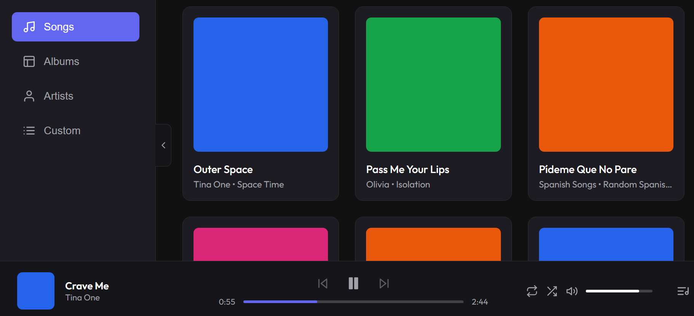

# Music Library

A beautifully designed, interactive music library application built with React and Vite. It allows users to browse their music collection, view albums and artists, play songs, and create custom selections.

## Featured Artists & Collections

The library features an exclusive collection of AI-generated music categorized by distinct artists and genres:

- **Freezone:** Featuring high-energy electronic and ambient tracks like *Blood Rave*, *Outer space*, and *Devils in the mist*.
- **Olivia:** A collection of melodic and pop-infused tracks including *Heaven and Hell*, *Maybe I'm the fool*, and *All night long*.
- **Spanish Songs:** A lively selection of Spanish tracks such as *Confía en mí*, *Pídeme que no pare*, and *Suave Respira*.
- **Tina One:** Soulful and intense tracks including *Pass Me Your Lips*, *Somebody drugged me*, and *Where is he*.

*Browse the full 20+ song catalog directly within the application!*

## Features
- **Library View:** Browse all available songs.
- **Albums & Artists:** Group and explore music by album or artist.
- **Custom Playlists:** Select multiple songs to queue up.
- **Audio Player:** Play, pause, skip forward/backward with spacebar shortcuts.
- **Dynamic Navigation:** Sleek sidebar for easy switching between views.

## Licensing & Copyright Notice
All music and audio content featured in this application is entirely AI-generated using [Suno](https://suno.com/). As the creator, I am the sole owner of this generated content and hold all commercial rights and ownership to it, in accordance with Suno's Terms of Service for paid subscribers.
